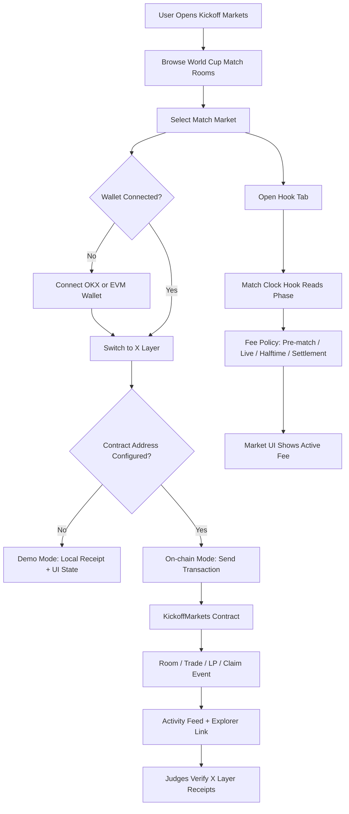

# Kickoff Markets

World Cup match markets on X Layer.

Kickoff Markets turns every fixture into a live trading room where users can trade team outcomes, add liquidity, and verify Match Clock Hook receipts from kickoff to final whistle.

The product is designed for the Build X / X Cup Hackathon: World Cup-native, X Layer-ready, Uniswap v4-aligned, and simple enough for fans to understand on first contact.

## Core Idea

Most prediction-market products treat a match as a static yes/no question. Kickoff Markets treats the match as a live market surface.

- Before kickoff, liquidity is cheaper and early LPs are incentivized.
- During live play, the Match Clock Hook can raise fees during volatile moments.
- At halftime, fees stabilize.
- After full-time, settlement and claim receipts become the main action.

The result is a product that turns World Cup attention into visible X Layer transactions: room creation, trades, liquidity adds, hook updates, and claims.

## Technical Flow



## Product Workflow

1. User opens the match board.
2. User searches or filters by `All`, `Live`, `Upcoming`, `Settling`, or `Portfolio`.
3. User selects a match card.
4. Match detail page opens with `Trade`, `Liquidity`, `Hook`, and `Activity` tabs.
5. User connects wallet and switches to X Layer.
6. User places a trade or adds liquidity.
7. If a contract address is configured, the app sends a transaction to X Layer.
8. The activity feed records the receipt and links to the explorer.
9. The Hook tab explains the phase-based fee logic.
10. After settlement, claim actions create final receipt flow.

## Project Structure

```txt
kickoff-markets/
├─ contracts/
│  ├─ KickoffMarkets.sol          # Match room, receipt, trade, LP, claim registry
│  ├─ MatchClockHook.sol          # Match phase to fee-policy surface
│  └─ README.md                   # Contract deployment notes
├─ public/
│  ├─ favicon.svg
│  └─ icons.svg
├─ src/
│  ├─ components/
│  │  └─ product/
│  │     ├─ AppTopbar.tsx         # Search, wallet, network, help controls
│  │     ├─ CreateRoomModal.tsx   # Draft custom match rooms
│  │     ├─ Footer.tsx            # Project footer and resource links
│  │     ├─ HowItWorksModal.tsx   # Stepper explaining the product flow
│  │     ├─ KickoffMark.tsx       # Brand mark
│  │     ├─ MarketBoard.tsx       # Homepage market grid
│  │     ├─ MarketCard.tsx        # Visual match card
│  │     ├─ MarketPage.tsx        # Trade, liquidity, hook, activity tabs
│  │     ├─ MarketTabs.tsx        # Market category navigation
│  │     └─ MatchPoster.tsx       # Custom SVG match visual
│  ├─ config/
│  │  ├─ contracts.ts             # X Layer and app contract configuration
│  │  └─ uniswapV4.ts             # Uniswap v4 addresses on X Layer
│  ├─ data/
│  │  └─ markets.ts               # Seed demo rooms, activity, positions
│  ├─ lib/
│  │  ├─ contractClient.ts        # EIP-1193 transaction calldata helpers
│  │  ├─ format.ts                # Number and currency formatting
│  │  └─ wallet.ts                # Wallet connect and X Layer switch helpers
│  ├─ types/
│  │  └─ integration.ts           # Shared action status types
│  ├─ App.tsx
│  ├─ index.css
│  └─ main.tsx
├─ .env.example
├─ .gitignore
├─ package.json
├─ vite.config.ts
└─ README.md
```

## Stack

- TypeScript
- React
- Vite
- Tailwind CSS v4
- Lucide React icons
- Solidity
- X Layer
- Uniswap v4 deployment targets

## Environment

Create a local `.env` from `.env.example`:

```bash
copy .env.example .env
```

Set the contract address after deploying `KickoffMarkets.sol`:

```txt
VITE_KICKOFF_MARKETS_ADDRESS=0xYourDeployedContract
```

Leave it blank to run in demo mode.

## Local Development

```bash
npm install
npm run dev
```

Build:

```bash
npm run build
```

Lint:

```bash
npm run lint
```

## Deployment

### 1. Deploy Contracts

Recommended deployment path for hackathon speed: Remix + OKX Wallet.

1. Open Remix.
2. Create or upload `contracts/KickoffMarkets.sol`.
3. Compile with Solidity `0.8.24` or newer compatible `0.8.x`.
4. Connect OKX Wallet or another EVM wallet.
5. Switch wallet to X Layer.
6. Deploy `KickoffMarkets`.
7. Copy the deployed contract address.
8. Optional: deploy `MatchClockHook` with your wallet address as `initialOperator`.

X Layer mainnet details:

```txt
Chain ID: 196
Hex Chain ID: 0xc4
RPC: https://rpc.xlayer.tech
Explorer: https://www.oklink.com/xlayer
Gas token: OKB
```

### 2. Configure Frontend

Add the deployed `KickoffMarkets` address to `.env`:

```txt
VITE_KICKOFF_MARKETS_ADDRESS=0xYourDeployedContract
```

Restart the dev server:

```bash
npm run dev
```

The app will now switch from local demo receipts to wallet transaction submissions.

### 3. Deploy Frontend

Build locally first:

```bash
npm run build
```

Then deploy the Vite app to Vercel, Netlify, or another static host. Configure the same `VITE_KICKOFF_MARKETS_ADDRESS` environment variable in the hosting dashboard.

## Contract Surface

The frontend currently calls:

```solidity
createRoom(string teamA, string teamB, string kickoff)
placeTrade(bytes32 roomId, uint8 side, uint256 usdcAmount)
addLiquidity(bytes32 roomId, uint8 side, uint256 usdcAmount)
claim(bytes32 roomId)
```

The amounts are encoded as USDC-style 6-decimal units on the client.

## Uniswap v4 Alignment

`src/config/uniswapV4.ts` contains the official Uniswap v4 deployment addresses used by the app for X Layer integration planning:

- PoolManager
- PositionManager
- StateView
- Quoter
- Universal Router
- Permit2

The current `MatchClockHook.sol` models the match phase to fee-policy surface. The next protocol step is wiring that policy into a full Uniswap v4 hook implementation around the X Layer PoolManager.

## Security Notes

- Never commit `.env`.
- Never commit private keys, wallet exports, keystores, or deployment secrets.
- `.gitignore` excludes `.env`, `.env.*`, key files, keystores, deployment artifacts, and contract build outputs.
- `.env.example` contains only non-secret placeholders.
- Use a fresh deployer wallet with only the funds needed for deployment.

## Verification

Current checks:

```bash
npm run lint
npm run build
```

## Hackathon Fit

| Judging Area | How Kickoff Markets Addresses It |
| --- | --- |
| Innovation | Match-aware markets with phase-based fee behavior instead of static prediction markets |
| Market potential | Converts World Cup attention into trading, liquidity, and shareable on-chain receipts |
| Completion | Working frontend, wallet flow, contract-ready transaction layer, deployable contracts |
| On-chain verifiability | Room, trade, LP, hook, and claim actions are designed as X Layer receipts |
| Demo video | The product flow can be shown in under three minutes: select match, connect wallet, trade, inspect hook, view receipt |

## Official Resources

- X Layer: https://web3.okx.com/xlayer
- X Layer docs: https://web3.okx.com/xlayer/docs/developer/build-on-xlayer/network-information
- Uniswap v4 deployments: https://developers.uniswap.org/docs/protocols/v4/deployments
- Onchain OS: https://web3.okx.com/onchainos
