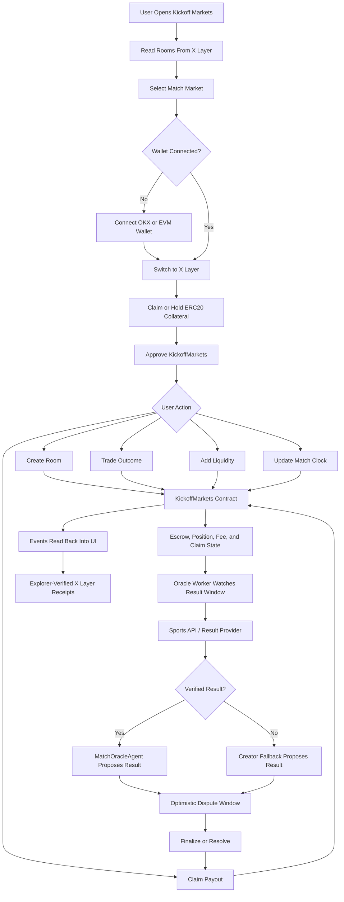

# Kickoff Markets

World Cup match markets on X Layer.

Kickoff Markets turns fixtures into live, escrow-backed trading rooms where users can trade team outcomes, add liquidity, follow Match Clock fee changes, settle a result, and claim payouts from on-chain collateral.

The product is built for the Build X / X Cup Hackathon: World Cup-native, X Layer-ready, oracle-assisted, and simple enough for fans to understand from the first screen.

## Core Idea

Most prediction markets treat a match as a static yes/no question. Kickoff Markets treats the match as a live market surface.

- Before kickoff, liquidity can enter while fees are low.
- During live play, the Match Clock Hook raises fees during volatile moments.
- At halftime, fee state stabilizes.
- After full-time, an oracle worker checks for the result, proposes settlement, and falls back to the creator path only when verified data is unavailable.

The result is a product that turns World Cup attention into visible X Layer activity: room creation, collateral approvals, trades, liquidity deposits, clock updates, settlement, and claims.

## Technical Flow



## Product Workflow

1. User opens the match board.
2. App reads rooms and events from the configured X Layer contract.
3. User creates a match room or opens an existing one.
4. User claims test collateral on testnet, or uses a configured real ERC20 collateral on mainnet.
5. User approves the market contract.
6. User trades a team outcome or adds liquidity.
7. Oracle worker or room creator updates Match Clock state as the match changes.
8. Oracle worker checks the post-match result window.
9. Oracle agent proposes the result when data is available.
10. If data is unavailable, creator fallback proposes the result.
11. Users may dispute during the optimistic window.
12. Finalized rooms unlock escrow-backed payouts.

## Project Structure

```txt
kickoff-markets/
|-- contracts/
|   |-- KickoffMarkets.sol          # AMM odds, escrow markets, optimistic settlement, claims
|   |-- KickoffTestUSDC.sol         # Testnet ERC20 collateral and faucet
|   |-- MatchOracleAgent.sol        # Oracle/operator settlement adapter
|   |-- MatchClockHook.sol          # Match phase to fee-policy surface
|   `-- README.md                   # Contract deployment notes
|-- public/
|   |-- favicon.svg
|   `-- icons.svg
|-- scripts/
|   |-- deploy-xlayer.mjs           # Terminal deployer for X Layer contracts and env updates
|   |-- oracle-worker.mjs           # Fixture importer, clock watcher, oracle settlement worker
|   `-- oracle-results.example.json # Manual provider rehearsal fixture
|-- src/
|   |-- assets/                     # Local brand and visual assets
|   |-- components/
|   |   `-- product/
|   |      |-- AppTopbar.tsx         # Search, wallet, network, help controls
|   |      |-- CreateRoomModal.tsx   # On-chain room creation form
|   |      |-- Footer.tsx            # Project footer and resources
|   |      |-- HowItWorksModal.tsx   # Product flow explanation
|   |      |-- KickoffMark.tsx       # Brand mark
|   |      |-- MarketBoard.tsx       # On-chain market grid
|   |      |-- MarketCard.tsx        # Visual match card
|   |      |-- MarketPage.tsx        # Trade, liquidity, hook, activity tabs
|   |      |-- MarketTabs.tsx        # Market category navigation
|   |      `-- MatchPoster.tsx       # Custom match visual
|   |-- config/
|   |   `-- contracts.ts             # X Layer, contract, and token configuration
|   |-- data/
|   |   `-- markets.ts               # Shared market types and hook copy
|   |-- lib/
|   |   |-- contractClient.ts        # ABI encoding, chain reads, tx helpers
|   |   |-- format.ts                # Number and currency formatting
|   |   |-- matchTime.ts             # Kickoff countdown and UTC match-time helpers
|   |   |-- oracleStatus.ts          # Oracle/fallback status derivation
|   |   `-- wallet.ts                # Wallet connect and network switch helpers
|   |-- types/
|   |   `-- integration.ts           # Shared action status types
|   |-- App.tsx
|   |-- index.css
|   `-- main.tsx
|-- .env.example
|-- .gitignore
|-- package-lock.json
|-- package.json
|-- vite.config.ts
`-- README.md
```

## Stack

- TypeScript
- React
- Vite
- Tailwind CSS v4
- Lucide React icons
- Viem
- Solidity
- X Layer

## Environment

Create a local `.env` from `.env.example`:

```bash
copy .env.example .env
```

Required after deployment:

```txt
VITE_X_LAYER_NETWORK=testnet
VITE_COLLATERAL_TOKEN_ADDRESS=0xYourCollateralToken
VITE_KICKOFF_MARKETS_ADDRESS=0xYourKickoffMarkets
VITE_MATCH_CLOCK_HOOK_ADDRESS=0xYourMatchClockHook
VITE_MATCH_ORACLE_AGENT_ADDRESS=0xYourMatchOracleAgent
```

Use `testnet` for rehearsal deployments and `mainnet` for the final deployment.

Oracle worker settings:

```txt
ORACLE_PROVIDER=manual
ORACLE_RESULTS_FILE=scripts/oracle-results.json
ORACLE_MATCH_MINUTES=90
ORACLE_RESULT_GRACE_MINUTES=30
ORACLE_POLL_SECONDS=60
ORACLE_HEALTH_PORT=
ORACLE_AUTOSUBMIT=false
ORACLE_OPERATOR_PRIVATE_KEY=
ORACLE_CLOCK_AUTOMATION=true
ORACLE_SETTLEMENT_AUTOMATION=true
ORACLE_FINALIZE_AUTOMATION=true
ORACLE_CLOCK_TARGET=markets
ORACLE_CLOCK_AUTHORIZED=false
ORACLE_PHASE_UPDATE_MINUTES=5
ORACLE_FOOTBALL_DATA_COMPETITION=WC
ORACLE_IMPORT_COMPETITION=WC
ORACLE_IMPORT_DATE_FROM=2026-06-11
ORACLE_IMPORT_DATE_TO=2026-06-18
ORACLE_IMPORT_STATUS=
ORACLE_IMPORT_LIMIT=32
ORACLE_PROBE_COMPETITION=WC
ORACLE_PROBE_DATE_FROM=2026-06-11
ORACLE_PROBE_DATE_TO=2026-06-18
ORACLE_PROBE_STATUS=
X_LAYER_RPC_URL=
FOOTBALL_DATA_API_TOKEN=
ORACLE_RESULT_ENDPOINT=
ORACLE_RESULT_API_KEY=
```

## Local Development

```bash
npm install
npm run dev
```

Build:

```bash
npm run build
```

Terminal deploy:

```bash
npm run deploy:xlayer -- --dry-run
npm run deploy:xlayer -- --write-env
```

Lint:

```bash
npm run lint
```

Oracle check:

```bash
npm run oracle:check
npm run oracle:dry
npm run oracle:import
npm run oracle:probe
npm run oracle:watch
```

## X Layer Networks

| Network | Env value | Chain ID | RPC | Explorer | Faucet |
| --- | --- | --- | --- | --- | --- |
| X Layer testnet | `testnet` | `1952` / `0x7a0` | `https://testrpc.xlayer.tech/terigon` | `https://www.okx.com/web3/explorer/xlayer-test` | `https://web3.okx.com/xlayer/faucet` |
| X Layer mainnet | `mainnet` | `196` / `0xc4` | `https://rpc.xlayer.tech` | `https://www.okx.com/web3/explorer/xlayer` | Use real OKB for gas |

## Deployment

### 1. Wallet Setup

1. Install OKX Wallet.
2. Create a fresh deployer wallet or import the wallet you intend to use.
3. Back up the seed phrase offline.
4. Switch to X Layer testnet.
5. Claim testnet OKB from the X Layer faucet for gas.

### 2. Deploy Contracts

Recommended hackathon deployment path: terminal deployer or Remix + OKX Wallet.

Terminal deployer, recommended when Remix or wallet injection is unstable:

1. Export the private key for a fresh deployer wallet from OKX Wallet.
2. Put it in `.env` as `X_LAYER_DEPLOYER_PRIVATE_KEY`. Do not share it and do not use a wallet holding meaningful funds.
3. Keep `VITE_COLLATERAL_TOKEN_ADDRESS` set if reusing an existing `KickoffTestUSDC`; otherwise pass `--deploy-token`.
4. Set `X_LAYER_OPERATOR_ADDRESS` to the wallet that should operate the oracle worker. If omitted, the deployer wallet is used.
5. Run a compile-only rehearsal:

```bash
npm run deploy:xlayer -- --dry-run
```

6. Deploy and write the new public contract addresses into `.env`:

```bash
npm run deploy:xlayer -- --write-env
```

To deploy a new test collateral token too:

```bash
npm run deploy:xlayer -- --deploy-token --write-env
```

The script deploys `KickoffMarkets`, `MatchClockHook`, and `MatchOracleAgent`, then calls `setMatchClockHook`, `setOracleAgent`, and `setClockOperator`.

Remix path:

1. Open Remix.
2. Upload `contracts/KickoffTestUSDC.sol` and `contracts/KickoffMarkets.sol`.
3. Compile with Solidity `0.8.24` or a compatible `0.8.x` compiler.
4. In Remix, enable optimizer and compile via configuration file with `viaIR: true`.
5. Select `Injected Provider - OKX Wallet`.
6. Confirm the wallet prompt shows X Layer testnet.
7. Open and compile `KickoffTestUSDC.sol`.
8. Deploy `KickoffTestUSDC`.
9. Copy the deployed token address.
10. Open and compile `KickoffMarkets.sol`.
11. Deploy `KickoffMarkets` with the token address as constructor input.
12. Copy the deployed market contract address.
13. Recommended: deploy `MatchClockHook` with the `KickoffMarkets` address as `initialOperator`.
14. Call `setMatchClockHook(hookAddress)` on `KickoffMarkets`.
15. Recommended: deploy `MatchOracleAgent` with `KickoffMarkets` and your oracle operator wallet.
16. Call `setOracleAgent(agentAddress)` on `KickoffMarkets`.
17. For automated live score/clock updates, call `setClockOperator(operatorWallet)` on `KickoffMarkets`, or set `ORACLE_CLOCK_TARGET=agent` and use the upgraded `MatchOracleAgent.submitClock` path.

### 3. Configure Frontend

Update `.env`:

```txt
VITE_X_LAYER_NETWORK=testnet
VITE_COLLATERAL_TOKEN_ADDRESS=0xYourKickoffTestUSDC
VITE_KICKOFF_MARKETS_ADDRESS=0xYourKickoffMarkets
VITE_MATCH_CLOCK_HOOK_ADDRESS=0xYourMatchClockHook
VITE_MATCH_ORACLE_AGENT_ADDRESS=0xYourMatchOracleAgent
ORACLE_PROVIDER=manual
```

Restart the dev server:

```bash
npm run dev
```

### 4. Verify Product Flow

1. Connect OKX Wallet.
2. Click `Faucet collateral` to mint test ERC20 collateral.
3. Create a match room.
4. Add liquidity or place a trade.
5. Use creator controls in the `Hook` tab, or run the oracle worker, to update the Match Clock state.
6. Run `npm run oracle:dry` after the expected full-time window.
7. If a result is available, the worker prints or submits `MatchOracleAgent.submitResult`.
8. If no result is available, use the creator fallback controls in the `Hook` tab.
9. Finalize after the dispute window, then claim payout.
10. Open the transaction link to verify the action on the X Layer explorer.

### 5. Deploy Frontend

Build locally first:

```bash
npm run build
```

Deploy the Vite app to Vercel, Netlify, or another static host. Configure the same `VITE_X_LAYER_NETWORK`, `VITE_COLLATERAL_TOKEN_ADDRESS`, and `VITE_KICKOFF_MARKETS_ADDRESS` environment variables in the hosting dashboard.

### 6. Deploy Oracle Worker

Run the oracle worker as a background service on Render, Railway, Fly, a VPS, or another Node host:

```bash
npm run oracle:watch
```

Recommended service environment:

```txt
VITE_X_LAYER_NETWORK=testnet
VITE_KICKOFF_MARKETS_ADDRESS=0xYourKickoffMarkets
VITE_MATCH_ORACLE_AGENT_ADDRESS=0xYourMatchOracleAgent
ORACLE_PROVIDER=manual
ORACLE_RESULTS_FILE=scripts/oracle-results.json
ORACLE_POLL_SECONDS=60
ORACLE_HEALTH_PORT=3001
ORACLE_FOOTBALL_DATA_COMPETITION=WC
X_LAYER_RPC_URL=https://testrpc.xlayer.tech/terigon
```

For production-style automation, use a backend-only operator wallet with limited gas funds:

```txt
ORACLE_PROVIDER=football-data
FOOTBALL_DATA_API_TOKEN=yourProviderToken
ORACLE_AUTOSUBMIT=true
ORACLE_OPERATOR_PRIVATE_KEY=backendOnlyPrivateKey
ORACLE_CLOCK_AUTOMATION=true
ORACLE_SETTLEMENT_AUTOMATION=true
ORACLE_FINALIZE_AUTOMATION=true
ORACLE_CLOCK_TARGET=markets
ORACLE_CLOCK_AUTHORIZED=true
```

Only set `ORACLE_CLOCK_AUTHORIZED=true` after the operator wallet has been authorized on-chain with `setClockOperator(operatorWallet)`. Never use a browser wallet seed phrase as the backend key.

Health endpoint:

```txt
/health
/ready
```

Probe the sports API before trusting it for settlement:

```bash
npm run oracle:probe
npm run oracle:probe -- --competition=WC --date-from=2026-06-11 --date-to=2026-06-18
npm run oracle:probe -- --competition=WC --date-from=2022-12-18 --date-to=2022-12-18 --status=FINISHED
```

Import real World Cup fixtures from the configured provider:

```bash
npm run oracle:import
npm run oracle:import -- --date-from=2026-06-11 --date-to=2026-06-18 --limit=8
```

By default the importer prints the creation calls. With `ORACLE_AUTOSUBMIT=true`, it submits the missing fixtures on-chain from the backend operator wallet.

## Contract Surface

The frontend calls:

```solidity
createRoom(string teamA, string teamB, string kickoff)
setClockOperator(address nextClockOperator)
placeTrade(bytes32 roomId, uint8 side, uint256 collateralAmount)
addLiquidity(bytes32 roomId, uint8 side, uint256 collateralAmount)
updatePhase(bytes32 roomId, Phase phase, string clock, string score, uint16 hookFeeBps)
proposeSettlement(bytes32 roomId, uint8 outcome, string score, string clock)
disputeSettlement(bytes32 roomId, string reason)
finalizeSettlement(bytes32 roomId)
resolveDispute(bytes32 roomId, uint8 outcome, string score, string clock)
claim(bytes32 roomId)
getRoomMeta(bytes32 roomId)
getRoomState(bytes32 roomId)
getRoomTotals(bytes32 roomId)
```

Collateral amounts are encoded as 6-decimal ERC20 units.

## Market Model

Kickoff Markets now uses an AMM-style binary market rather than a static stake ratio. Liquidity providers seed both outcome reserves with collateral-backed complete sets. A trader buying one side moves the reserve curve and receives outcome shares. The displayed odds come from the pool reserves:

```txt
Side A odds = reserveB / (reserveA + reserveB)
Side B odds = reserveA / (reserveA + reserveB)
```

At final settlement, winning shares redeem from escrow. LPs receive their pro-rata value of the winning reserve plus accumulated fee pool.

## Optimistic Settlement

Settlement is not instant manual finalization. A creator or configured oracle agent proposes an outcome:

```txt
1 = cancel
2 = side A wins
3 = side B wins
```

The room enters a dispute window. A positioned user can dispute before the deadline. If undisputed, anyone can finalize after the window. If disputed, the creator, owner, or oracle agent must resolve the outcome.

## Match Clock Hook

`MatchClockHook.sol` is the match-state fee policy. It records `phase`, `clock`, `score`, and `feeBps` for each room and maps match phases to fees:

- Pre-match: low fee for early liquidity.
- Live: higher fee for volatile moments.
- Halftime: stabilized fee.
- Settlement: lower fee while claims close the room.

When `KickoffMarkets.setMatchClockHook(hookAddress)` is configured, `KickoffMarkets.updatePhase` calls the hook and uses the fee returned by the hook. Without a linked hook, the market falls back to the fee suggested by the UI or oracle worker.

## Oracle Path

Chainlink settlement is not a hard dependency on X Layer testnet. Kickoff Markets uses an oracle-agent adapter that can be driven by a sports API or by a local verified result file during rehearsal:

1. `scripts/oracle-worker.mjs` runs as a long-lived backend process with `npm run oracle:watch`.
2. The worker reads rooms from `KickoffMarkets` on every poll.
3. It checks the configured provider: `manual`, `football-data`, or `generic`.
4. During live matches, it prepares or submits Match Clock updates.
5. After full-time, it prepares or submits `MatchOracleAgent.submitResult`.
6. If a proposal is undisputed after the dispute window, it prepares or submits finalization.
7. If verified data is unavailable, the creator fallback remains available through the UI.
8. Users still receive the optimistic dispute window before finalization.

If the provider cannot return a verified result, the UI displays creator fallback and the room creator can propose the result through the same optimistic settlement path. This keeps the product deployable on X Layer testnet without pretending an unsupported Chainlink feed exists.

Manual rehearsal file:

```bash
copy scripts\oracle-results.example.json scripts\oracle-results.json
npm run oracle:dry
npm run oracle:watch
```

## Security Notes

- Never commit `.env`.
- Never commit private keys, wallet exports, keystores, or deployment secrets.
- `.gitignore` excludes `.env`, `.env.*`, key files, keystores, deployment artifacts, and contract build outputs.
- `.env.example` contains only non-secret placeholders.
- Use a fresh deployer wallet with only the funds needed for deployment.

## Verification

Current checks:

```bash
npm run lint
npx tsc -b
npm run build
node --check scripts/oracle-worker.mjs
```

## Hackathon Fit

| Judging Area | How Kickoff Markets Addresses It |
| --- | --- |
| Innovation | Match-aware markets with phase-based fees instead of static prediction rooms |
| Market potential | Converts World Cup attention into trading, liquidity, and shareable X Layer receipts |
| Completion | Working frontend, wallet flow, ERC20 collateral, escrow, oracle-assisted settlement, and claim contracts |
| On-chain verifiability | Rooms, approvals, trades, LP deposits, clock updates, settlement proposals, disputes, finalization, and claims are explorer-visible |
| Demo video | Select match, claim collateral, trade, inspect hook state, run oracle worker, settle, claim payout, show explorer receipts |

## Official Resources

- X Layer: https://web3.okx.com/xlayer
- X Layer docs: https://web3.okx.com/xlayer/docs/developer/build-on-xlayer/network-information
- X Layer faucet: https://web3.okx.com/xlayer/faucet
- Onchain OS: https://web3.okx.com/onchainos
