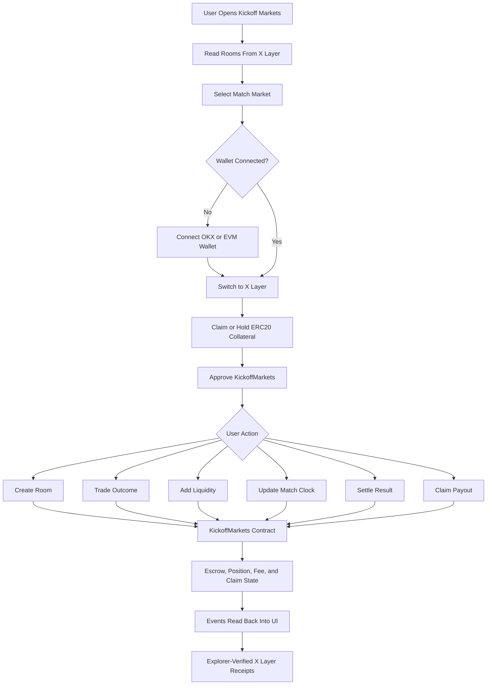

# Kickoff Markets

World Cup match markets on X Layer.

Kickoff Markets turns fixtures into live, escrow-backed trading rooms where users can trade team outcomes, add liquidity, follow Match Clock fee changes, settle a result, and claim payouts from on-chain collateral.

The product is built for the Build X / X Cup Hackathon: World Cup-native, X Layer-ready, Uniswap v4-aligned, and simple enough for fans to understand from the first screen.

## Core Idea

Most prediction markets treat a match as a static yes/no question. Kickoff Markets treats the match as a live market surface.

- Before kickoff, liquidity can enter while fees are low.
- During live play, the Match Clock Hook raises fees during volatile moments.
- At halftime, fee state stabilizes.
- After full-time, creator settlement unlocks claims from escrow.

The result is a product that turns World Cup attention into visible X Layer activity: room creation, collateral approvals, trades, liquidity deposits, clock updates, settlement, and claims.

## Technical Flow



## Product Workflow

1. User opens the match board.
2. App reads rooms and events from the configured X Layer contract.
3. User creates a match room or opens an existing one.
4. User claims test collateral on testnet, or uses a configured real ERC20 collateral on mainnet.
5. User approves the market contract.
6. User trades a team outcome or adds liquidity.
7. Room creator updates the Match Clock fee state as the match changes.
8. Room creator settles the result or cancels the room.
9. Users claim escrow-backed payouts.

## Project Structure

```txt
kickoff-markets/
|-- contracts/
|   |-- KickoffMarkets.sol          # Escrow markets, settlement, claims
|   |-- KickoffTestUSDC.sol         # Testnet ERC20 collateral and faucet
|   |-- MatchClockHook.sol          # Match phase to fee-policy surface
|   `-- README.md                   # Contract deployment notes
|-- public/
|   |-- favicon.svg
|   `-- icons.svg
|-- src/
|   |-- components/
|   |   `-- product/
|   |      |-- AppTopbar.tsx         # Search, wallet, network, help controls
|   |      |-- CreateRoomModal.tsx   # On-chain room creation form
|   |      |-- Footer.tsx            # Project footer and resources
|   |      |-- HowItWorksModal.tsx   # Product flow explanation
|   |      |-- KickoffMark.tsx       # Brand mark
|   |      |-- MarketBoard.tsx       # On-chain market grid
|   |      |-- MarketCard.tsx        # Visual match card
|   |      |-- MarketPage.tsx        # Trade, liquidity, hook, activity tabs
|   |      |-- MarketTabs.tsx        # Market category navigation
|   |      `-- MatchPoster.tsx       # Custom match visual
|   |-- config/
|   |   |-- contracts.ts             # X Layer, contract, and token configuration
|   |   `-- uniswapV4.ts             # Uniswap v4 addresses on X Layer
|   |-- data/
|   |   `-- markets.ts               # Shared market types and hook copy
|   |-- lib/
|   |   |-- contractClient.ts        # ABI encoding, chain reads, tx helpers
|   |   |-- format.ts                # Number and currency formatting
|   |   `-- wallet.ts                # Wallet connect and network switch helpers
|   |-- types/
|   |   `-- integration.ts           # Shared action status types
|   |-- App.tsx
|   |-- index.css
|   `-- main.tsx
|-- .env.example
|-- .gitignore
|-- package.json
|-- vite.config.ts
`-- README.md
```

## Stack

- TypeScript
- React
- Vite
- Tailwind CSS v4
- Lucide React icons
- Solidity
- X Layer
- Uniswap v4 deployment targets

## Environment

Create a local `.env` from `.env.example`:

```bash
copy .env.example .env
```

Required after deployment:

```txt
VITE_X_LAYER_NETWORK=testnet
VITE_COLLATERAL_TOKEN_ADDRESS=0xYourCollateralToken
VITE_KICKOFF_MARKETS_ADDRESS=0xYourKickoffMarkets
```

Use `testnet` for rehearsal deployments and `mainnet` for the final deployment.

## Local Development

```bash
npm install
npm run dev
```

Build:

```bash
npm run build
```

Lint:

```bash
npm run lint
```

## X Layer Networks

| Network | Env value | Chain ID | RPC | Explorer | Faucet |
| --- | --- | --- | --- | --- | --- |
| X Layer testnet | `testnet` | `1952` / `0x7a0` | `https://testrpc.xlayer.tech/terigon` | `https://www.okx.com/web3/explorer/xlayer-test` | `https://web3.okx.com/xlayer/faucet` |
| X Layer mainnet | `mainnet` | `196` / `0xc4` | `https://rpc.xlayer.tech` | `https://www.okx.com/web3/explorer/xlayer` | Use real OKB for gas |

## Deployment

### 1. Wallet Setup

1. Install OKX Wallet.
2. Create a fresh deployer wallet or import the wallet you intend to use.
3. Back up the seed phrase offline.
4. Switch to X Layer testnet.
5. Claim testnet OKB from the X Layer faucet for gas.

### 2. Deploy Contracts

Recommended hackathon deployment path: Remix + OKX Wallet.

1. Open Remix.
2. Upload `contracts/KickoffTestUSDC.sol` and `contracts/KickoffMarkets.sol`.
3. Compile with Solidity `0.8.24` or a compatible `0.8.x` compiler.
4. Select `Injected Provider - OKX Wallet`.
5. Confirm the wallet prompt shows X Layer testnet.
6. Open and compile `KickoffTestUSDC.sol`.
7. Deploy `KickoffTestUSDC`.
8. Copy the deployed token address.
9. Open and compile `KickoffMarkets.sol`.
10. Deploy `KickoffMarkets` with the token address as constructor input.
11. Copy the deployed market contract address.
12. Optional: deploy `MatchClockHook` with your wallet address as `initialOperator`.

### 3. Configure Frontend

Update `.env`:

```txt
VITE_X_LAYER_NETWORK=testnet
VITE_COLLATERAL_TOKEN_ADDRESS=0xYourKickoffTestUSDC
VITE_KICKOFF_MARKETS_ADDRESS=0xYourKickoffMarkets
```

Restart the dev server:

```bash
npm run dev
```

### 4. Verify Product Flow

1. Connect OKX Wallet.
2. Click `Faucet collateral` to mint test ERC20 collateral.
3. Create a match room.
4. Add liquidity or place a trade.
5. Use creator controls in the `Hook` tab to update phase or settle the market.
6. Claim payout after settlement.
7. Open the transaction link to verify the action on the X Layer explorer.

### 5. Deploy Frontend

Build locally first:

```bash
npm run build
```

Deploy the Vite app to Vercel, Netlify, or another static host. Configure the same `VITE_X_LAYER_NETWORK`, `VITE_COLLATERAL_TOKEN_ADDRESS`, and `VITE_KICKOFF_MARKETS_ADDRESS` environment variables in the hosting dashboard.

## Contract Surface

The frontend calls:

```solidity
createRoom(string teamA, string teamB, string kickoff)
placeTrade(bytes32 roomId, uint8 side, uint256 collateralAmount)
addLiquidity(bytes32 roomId, uint8 side, uint256 collateralAmount)
updatePhase(bytes32 roomId, Phase phase, string clock, string score, uint16 hookFeeBps)
settle(bytes32 roomId, Settlement outcome, string score, string clock)
claim(bytes32 roomId)
getRoomMeta(bytes32 roomId)
getRoomState(bytes32 roomId)
getRoomTotals(bytes32 roomId)
```

Collateral amounts are encoded as 6-decimal ERC20 units.

## Match Clock Hook

`MatchClockHook.sol` is the match-state fee policy. It records `phase`, `clock`, `score`, and `feeBps` for each room and maps match phases to fees:

- Pre-match: low fee for early liquidity.
- Live: higher fee for volatile moments.
- Halftime: stabilized fee.
- Settlement: lower fee while claims close the room.

In the current product, the `Hook` tab updates the same phase and fee state through `KickoffMarkets.updatePhase`. The next Uniswap v4 step is wiring that policy into a full hook around the X Layer PoolManager.

## Uniswap v4 Alignment

`src/config/uniswapV4.ts` contains the official Uniswap v4 deployment addresses used by the app for X Layer integration planning:

- PoolManager
- PositionManager
- StateView
- Quoter
- Universal Router
- Permit2

## Security Notes

- Never commit `.env`.
- Never commit private keys, wallet exports, keystores, or deployment secrets.
- `.gitignore` excludes `.env`, `.env.*`, key files, keystores, deployment artifacts, and contract build outputs.
- `.env.example` contains only non-secret placeholders.
- Use a fresh deployer wallet with only the funds needed for deployment.

## Verification

Current checks:

```bash
npm run lint
npm run build
```

## Hackathon Fit

| Judging Area | How Kickoff Markets Addresses It |
| --- | --- |
| Innovation | Match-aware markets with phase-based fees instead of static prediction rooms |
| Market potential | Converts World Cup attention into trading, liquidity, and shareable X Layer receipts |
| Completion | Working frontend, wallet flow, ERC20 collateral, escrow, settlement, and claim contracts |
| On-chain verifiability | Rooms, approvals, trades, LP deposits, clock updates, settlement, and claims are explorer-visible |
| Demo video | Select match, claim collateral, trade, inspect hook state, settle, claim payout, show explorer receipts |

## Official Resources

- X Layer: https://web3.okx.com/xlayer
- X Layer docs: https://web3.okx.com/xlayer/docs/developer/build-on-xlayer/network-information
- X Layer faucet: https://web3.okx.com/xlayer/faucet
- Uniswap v4 deployments: https://developers.uniswap.org/docs/protocols/v4/deployments
- Onchain OS: https://web3.okx.com/onchainos
